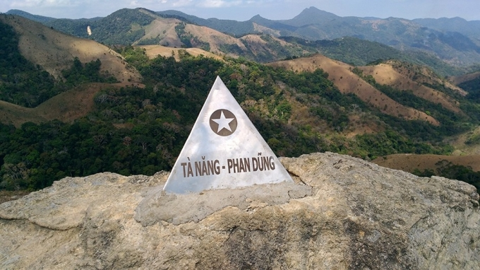

Nhiều người cứ hỏi sao không lựa chọn những chuyến đi nào nhẹ nhàng, nghỉ dưỡng mà cứ thích lao vào những chuyến đi gian nan, cực khổ chi vậy. 
Hmm, cuộc sống này nếu muốn biết bản thân mình đạt tới giới hạn nào thì cần phải luôn thử thách chính mình. Có trải qua được những thứ chông gai như vậy, thì mọi khó khăn trên đời này mình mới có thể tự tin dấn thân vào những việc khó và chính bản thân cũng sẽ được "upgrade" đáng kể.

Đợt này, mấy đứa nhỏ quen được trong chuyến đi leo núi Chứa Chan rủ bọn mình tham gia hành trình chinh phục cung đường trekking đẹp nhất Việt Nam - Tà Năng - Phan Dũng. Bọn mình khá là háo hức và đồng ý tham gia ngay. Chia sẻ luôn là lần này là lần thứ 3 mình tham gia cung đường này đấy.

Tại sao lại đi nhiều lần như vậy? Đơn giản vì mình thích. Mình thích được thử thách bản thân. 2 lần rồi đều là 2 lần trải nghiệm khác nhau hoàn toàn. 1 lần bị lạc trong đợt cỏ cháy khô và cạn nước uống. 1 lần đi chung với nhóm ở cty cũ. Và mình cũng tin lần thứ 3 này sẽ là trải nghiệm mới, sau những câu chuyện ly kì của vài vụ trước đó báo chí có đưa tin (mình không muốn kể chi tiết hơn), và bão số 4 vừa đi qua, cũng là mùa cỏ đẹp nhất, lại được đi chung với "cô bạn thân cùng nhà" cùng với nhiều bạn mới khác nữa.

# Hồi 1 - Xuất phát
Hành trình của bọn mình bắt đầu tại chợ Đà Loan. Ăn sáng, chuẩn bị nước uống, giày dép xong xuôi thì lên xe 4 bánh bon bon chạy 1 đoạn đường khoảng 30km để đến điểm xuất phát cung. Đến nơi nhóm được giới thiệu làm quen chú chó tên Heo. Chú ấy rất hiền và dễ thương nhé. Chắc có lẽ quen biết bao khách rồi nên dạn dĩ ra hẳn. Xoa xoa, nựng nịu chú chó mà chú ấy thích dã man con ngan :D. Ngoài ra còn được bonus thêm kiến thức tại sao cây cà ri trồng bao ngoài cây cà phê (do trên đoạn đường quan sát thấy người dân người ta trồng như thế). Lý do là tại vì ... cây cà phê trồng bên trong cây cà ri. Tào laooooo ghê haha.

Trước khi xuất phát, 4 bạn nam cực kỳ dễ thương của tour Trekking BaoLe (Tiến, Bảo, Ân, Huy) hướng dẫn 10 bạn còn lại trong nhóm làm nóng toàn thân và cung cấp những kiến thức rất hữu ích như cách sử dụng gậy đi rừng, hoặc về cách thức làm nóng cơ thể sao cho hiệu quả. Làm nóng cũng vui lắm. Vừa làm nóng lại "được" chụp lén những khoảnh khắc tự nhiên. Ai ai cũng miệng rạng ngời. Ờ để xem lát đi coi còn cười được như vậy nữa không nha. 

# Hồi 2 - "Bắt ếch" giữa rừng
Nghêu ngao giữa khu rừng với những bản tình ca, có bài vui bài buồn để xoa đi nỗi mệt nhọc cả đoàn. Thời tiết lúc đi khá là đẹp, không nắng không mưa. Chuyến đi này không chỉ để đi bằng đôi chân mà còn đi bằng cả trái tim thiện nguyện. Các bạn bên tour đã trao cho các gia đình người dân tộc nghèo khó (nhớ không lầm thì đa số là dân tộc Churu) ở phía bìa rừng những bộ quần áo, thùng sữa và thùng mì. Tuy những phần quà đơn giản nhưng lại thấm đậm nghĩa tình, sưởi ấm biết bao mảnh đời. Bắt gặp những đôi mắt của bọn trẻ long lanh, cười hồn nhiên cũng thấy được niềm hạnh phúc ở người nhận và người cho. Hạnh phúc đôi khi chỉ cần đơn giản thế.

Tiếp tục hành trình thôi. Đi qua những ngọn đồi, những cánh rừng, và băng qua các con suối nhỏ, đầu óc buông xõa hết mọi phiền muộn của cuộc sống, của công việc. Giữa những con người xa lạ, tự dưng trở nên thân thương, gắn kết. Biết được tên các thành viên, công việc cũng như tuổi tác thế nào. 

Những lần thành viên trong đoàn bị té cái bịch, cái mông in dấu lên đá, lên đám sình, là một tràng cười sản khoái từ các bạn bên tour. Không hiểu lý do gì khi té bị gọi là "bắt ếch". Té nhiều lần thì có nguyên tô cháo ếch Singapore haha. Cháo ếch không thấy đâu, chỉ thấy đau.

Đi đoạn đường dài, đến gần trưa là tới cột mốc  hay cái chóp Tà Năng - Phan Dũng, nơi đánh dấu vùng giao giữa 3 tỉnh Lâm Đồng, Ninh Thuận và Bình Thuận. Whoa, khung cảnh thiệt hùng vĩ, đẹp đẽ biết bao. Bao quanh là những ngọn đồi và cánh rừng xanh mướt. Tách tách...
Giọt nước rơi càng lúc càng nhiều từ trên trời. Vội vàng mặc áo mưa và leo xuống đồi. Ôi, dốc xuống thì dài, dốc và rất trơn nhé. Phải cẩn thận và đi chậm rãi, bước nào chắc bước đó. Không thôi lại đầy tô cháo ếch 🤪.

# Hồi 3 - Ngồi bên nhau
Đi và đi, đến quả đồi khác thì lại cùng nhau nghỉ trưa. Chỉ là những nắm cơm bọc lá ăn kèm với thịt kho hột vịt. Rất đơn giản nhưng lại cực kì ngon nha. Có mấy khi được ăn cơm trưa mà được ngắm nhìn với hàng rừng cây xanh xung quanh. Lại tách tách...

Ăn xong, có sức, có thêm năng lượng. Xách cái mông đi tiếp. Mặc lại áo mưa và băng qua những cánh rừng và nhiều ngọn đồi. Nhiều lần xuống dốc đầy đất đỏ đã thấm nước, trơn trợt và dễ "bắt ếch" như chơi.

Cũng gần tối, bọn mình đến chỗ hạ trại. Ôi cha. Ở một nơi giữa rừng sâu thăm thẳm. có những cái lều xinh xinh, khu tụ tập ăn uống dã chiến, lại có cả vài phòng tắm, và toilet không mái che. Quá đủ và tuyệt vời quá rồi. 

Nghỉ ngơi uống những cốc đá chanh và ăn chè, sau đó tắm rửa sạch sẽ để đến tối cùng nhau tụ tập ăn uống no nê nè.
Đừng tưởng trên từng ko có món ngon nhen. Nào là cháo, gà nướng, thịt nướng, sà lách... Ngon và bao no.

Vừa ăn vừa chơi trò chơi để xử lý hết đồ ăn quá nhiều. Mà ngộ cái ai thua sẽ phải ăn thêm. Chả biết đây là hình phạt hay phần thưởng cho người thua hí hí.

Càng về tối, mọi thứ lại càng chill và ý nghĩa hơn. Tiến, một người của tour đã vác cái đàn ghita từ bìa rừng lên đây để đánh những bài ca theo yêu cầu. Cả nhóm cùng nhau ngân ca vang cả khu rừng. Ca hát say sưa xong thì giây phút cả đoàn trầm lắng 1 tí xíu, để cùng nhau chia sẻ những cảm xúc thăng trầm, góc khuất của mọi người. Hiểu nhau hơn và cũng nhận được nhiều giá trị trong cuộc sống này.

À giữa rừng bạn có tin có luôn cả dịch vụ đấm bóp, massage ko. Tin đi. Có cả cái giường, có cái lỗ úp cái mặt xuống để massage thiệt đấy. Bảo, là tay massage thứ thiệt đấy nhé. Chả đùa được đâu. 

Tối cả đoàn vào lều nghỉ ngơi, lấy lại năng lượng cho ngày hôm sau...

# Hồi 4 - Tháo khớp gối và chơi thú nhúng
Ngày mới đón chào chúng mình bằng buổi sáng có bình minh, trời trong và có mây bao quanh. Nhâm nhi vài ly cà phê nóng Nescafe và ăn vội tô nui thịt xương để kịp xuất phát sớm.

Vẫn là hành trình băng rừng vượt suối. Ngày hôm nay không leo nhiều nhưng phải thả dốc khá nhiều khiến đôi chân và đầu gối phải làm việc lao lực không kém ngày đầu. Chưa kể những đoạn đốc trơn trợt vì đất ngấm nước mưa. Đi qua những con đồi cỏ xanh tươi, trời trong xanh, nắng tốt, chúng mình đã cùng nhau lưu lại nhiều khung hình cực kì đắt giá.

Đến một con suối, chúng mình dừng chân một tí, ngâm đôi chân rã rời vào dòng suối mát lạnh. Sẵn tiện rửa sạch đôi giày đã dính đầy bùn cát không còn độ bám. Vừa ngâm chân lại còn đùa giỡn không quên chụp vài tắm nô đùa cùng 1 ván gỗ đặt trên mấy cục đá trên suối. Cũng già mà vẫn còn ham vui hí hí.

Đi đoạn dường dài để đến phía ngoài bìa rừng, chúng mình tiếp tục trải nghiệm dịch vụ "Grab rừng". Không giống Grabbike trên thành thị mọi người từng thấy, xe ở đây toàn xe độ, có thể gọi là độc quyền ở nơi đây. Bánh xe thì đầy xích để tăng độ bám và khả năng leo dốc. Tưng tưng, đôi mông cứ như thú nhún. Đường ra khỏi rừng không hề đơn giản, biết làm khó những tay lái cự phách. Xe thản nhiên băng qua vài con suối, băng qua vài ổ voi, à chắc là ổ khủng long luôn thì có. Thử nghĩ nhé, mất gần nửa tiếng là ra khỏi rừng thì đôi mông nó ê biết chừng nào phải nhún lên xuống liên tục. Sau đó đi ra đường lộ mất thêm gần 10 phút để đến chỗ trạm nghỉ để tắm rửa và ăn trưa chính thức kết thúc hành trình chinh phục Tà Năng - Phan Dũng. Ờ mà chưa hẳn kết thúc, còn vài tiết mục hay ho nữa nha...

# Hồi 5 - Lưu luyến
Tắm suối đi mọi người ơi! Cạnh trạm nghỉ có một con suối khá lớn. Tủm. Gần cả đoàn xuống suối tắm và đùa giỡn với nhau trong dòng suối mát. Rửa trôi đi những bụi bẩn trên gương mặt để lộ ra những nụ cười và ánh mắt sảng khoải tự hào vì con đường khó khăn chúng mình đã vượt qua. "Sư thầy" Tiến thì trình diễn kungfu Thiếu Lâm ngay tại "sân khấu nước", cái đầu tròn tròn ko thể mọc được cọng tóc nào, đặt lên một tảng đá to và thực hiện trồng cây chuối trong sự trầm trồ khen ngợi của mọi người. 

Sau khi ăn trưa xong, mọi người lên xe trung chuyển để ra bến xe về lại Sài Gòn. Trên chuyến xe trung chuyển, mọi người chia sẻ những cảm nhận về chuyến đi. Ai nấy đều có những phản hồi cực kì tốt và đấy là chuyến đi rất nhiều kỉ niệm đối với cả đoàn.

Lên xe giường nằm, dù mệt sau chuyến đi, nhưng vì không nỡ xa nhau sau chuyến đi nhiều kỉ niệm, không ai chịu ngủ, vẫn muốn tụ tập gần nhau kể những câu chuyện tầm phào, cả những chuyện kinh dị, ma cỏ. Sao mà thời gian nhanh qua mau đến vậy, mới đó đã 2 ngày rồi sao! Tiệc vui nào cũng có lúc tàn. Gặp được nhau đã là cái duyên rồi, còn liên lạc với nhau nữa hay không là chuyện khác. Mọi người sẽ tính hẹn nhau một buổi để ăn chơi hậu chuyến đi nữa này.

Sẽ sớm gặp lại nhau nữa thôi. Nhớ mọi người!